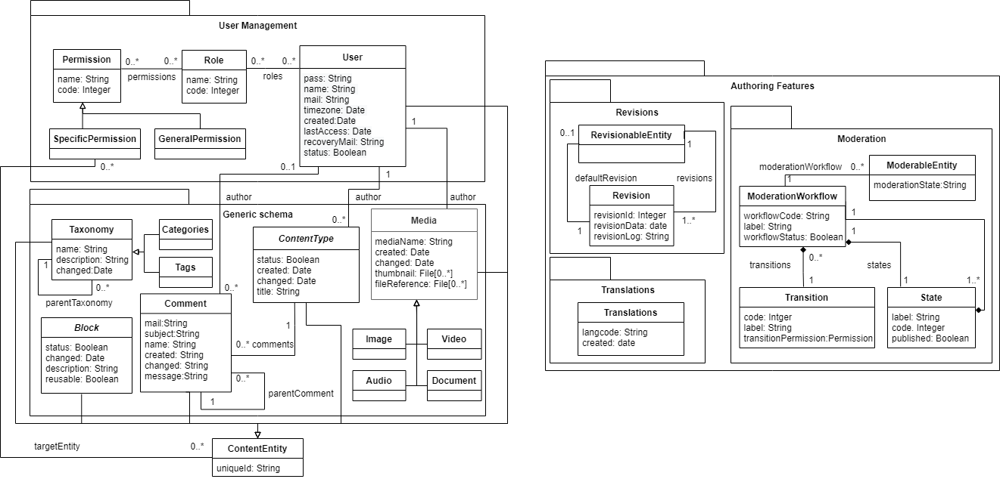
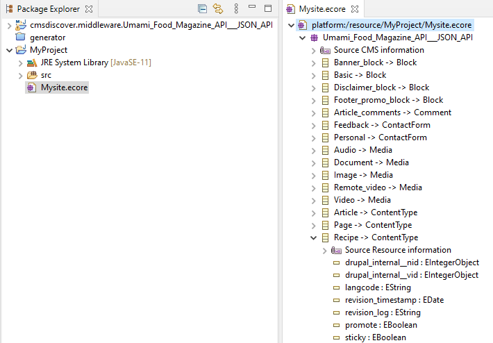

# CMS Discoverer

A prototype tool that boosts the integration of Headless CMS into MDE apps. This tool allows you to: 

1 - Quickly discover the content exposed by the CMS API by extracting its model automatically. 

2 - Represent this model in a standard notatios, as UML, to facilitate the integration with other parts of the system.

3 - Generatea a java library in charge of the communication between your apps and the source CMS.

The java library is built as a maven artifact and ready to be integrated to your consumer app. This tool is built as a Eclipse Plug-in and can be used following the instructions of this file.


## Background of the tool

The main objective of this tool is to reduce the cost of the integration of Headless CMS in Enterprise IT ecosystems. To achieve this, we have proposed a generic model for Headless CMS. Here is the proposed generic model that serves as central piece of this tool.



## Prerequisites and supported technologies

* The toolkit requires [Eclipse 4.12 (2019-06)](https://download.eclipse.org/eclipse/downloads/drops4/R-4.12-201906051800/) or [above](https://download.eclipse.org/eclipse/downloads/).

* The toolkit requires [EMF 2.10 (2015-01)](http://download.eclipse.org/modeling/emf/emf/builds/release/2.10/index.html) or [above](https://download.eclipse.org/eclipse/downloads/).

* For Drupal: 
  - [JSON:API](https://www.drupal.org/project/jsonapi) - Drupal core 8.1 or above.
  - <a href=https://www.drupal.org/project/openapi_jsonapi> Open API for JSON API </a> activated
  - Set Open API for JSON API available for anonymous request (not authentication supported by now)
* For Wordpress:
  - A [REST API v2](https://developer.wordpress.org/rest-api/reference/) enabled - Wordpress core 4.7 or above
  - Two of the following API authentication plugins
    - [Basic auth] (https://github.com/WP-API/Basic-Auth)
    - [JWT auth] (https://es.wordpress.org/plugins/jwt-authentication-for-wp-rest-api/)


## Installation

To install this tool open your Eclipse Installation, go to Help -> Install new softare and set the following update site:

https://som-research.github.io/CMS-Headless-Modeling/updates/


## Usage and Examples

### Extracting the CMS model

Once you have your eclipse application with this plugin installed, you should have at least one project opened. 

1 - Then go to File -> Import 

2 - Select Import CMS model


3 - Select the project and the folder where the model will be saved

4 - Set a name for the output model file

5 - Select the technology of the source CMS

6 - Set the url of the site (for example: https://www.mysupersite.com)

7 - In WordPress case you need to fill user and password (check that you have the supported authentication plugins enabled)


8 - Then, refresh your project folder. You will see a model like the following example:




### Genearting the connector java library

Navigate to the .ecore file created in the root of the selected project. Click right button and search for "Generate CMS Connector"


Then a new project with the code will be created. Inside the packages "tests" there are some basic usage examples as:

#### Init site and search query
```
MySite siteManager = new mySite();
SearchQueryBuilder searchQuery = siteManager.getSearchQueryBuilder();
```

##### Listing content
```
List<Recipe> recipeList = siteManager.searchRecipe(searchQuery.build());
String Title = recipeList.get(3).getTitle());

```
#### Search with filters
```
searchQuery.addFilter(Post.FILTER_FIELD_COOKING_TIME, "30");
List<Recipe> recipeFilteredList = siteManager.searchRecipe(searchQuery.build());
print(recipeFilteredList.get(0).getTitle());
```
  
#### Get content by id

```
Recipe singleRecipe = siteManager.getRecipeById(recipeFilteredList.get(0).getUuid());
print(singleRecipe.getTitle());
```
 
#### Navigate between relationships

```
List<Tags> tags = singleRecipe.getFieldTags();
tags.forEach((tag) ->{
  print(tag.getName());
});
```


## Project Content and Credits

Author and maintainer: Joan Giner

SOM Research Group
