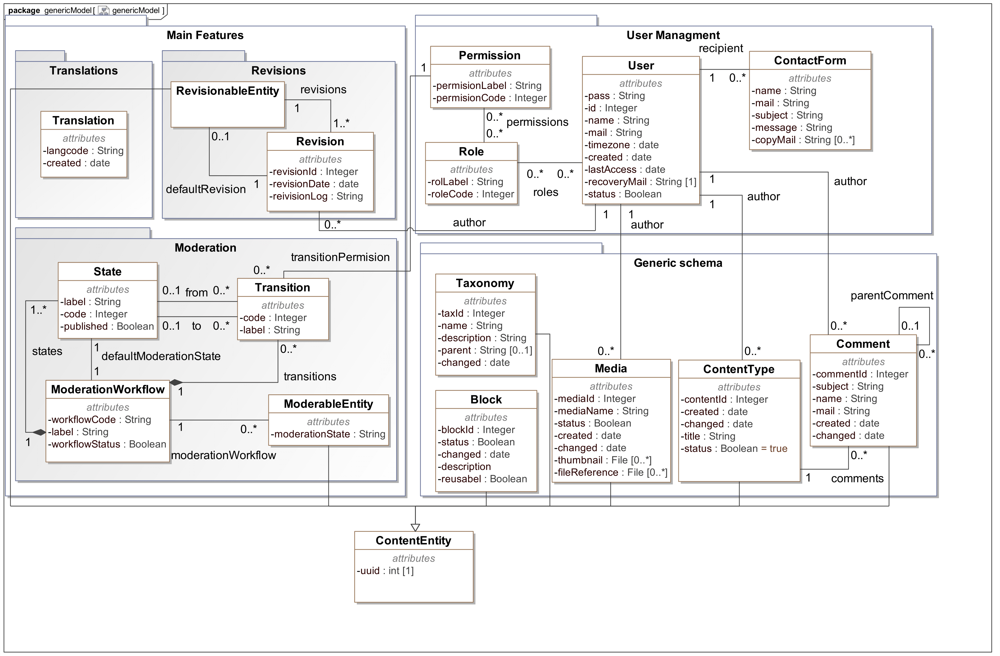
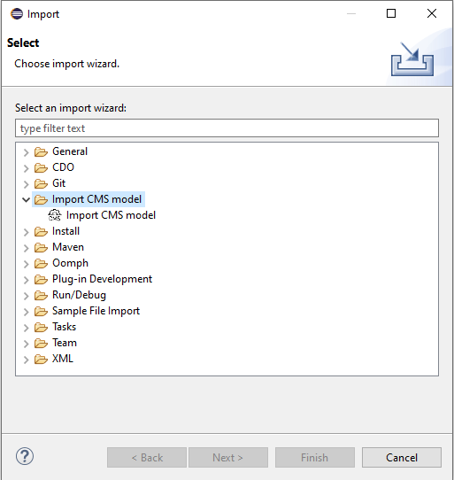
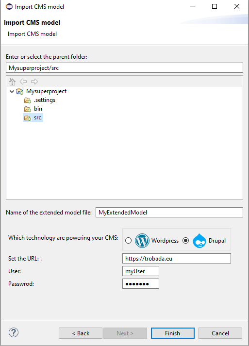
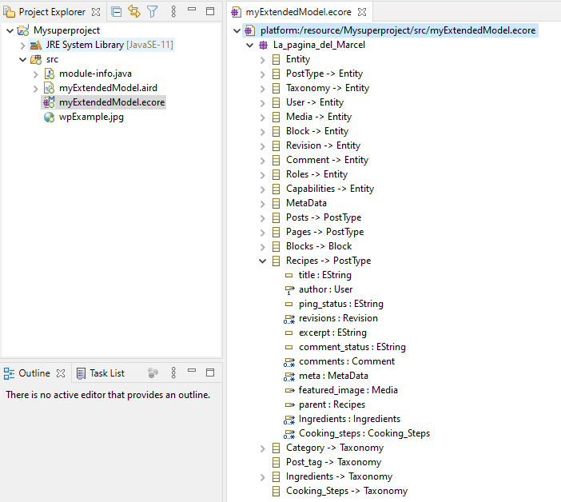

# Headless CMS model extractor

This repository contains a prototype of a tool able to extract the Model from a Wordpress or Drupal CMS by analyzing its API. This tools works over the Eclipse Modeling Framework and generates the concrete model of a CMS instance using Ecore. This tool is built as a Eclipse Plug-in and can be used following the instructions of this file.

## Headless CMS generic model

The main objective of this tool is to reduce the cost of the integration of Headless CMS in Enterprise IT ecosystems. To achieve this, we have proposed a generic model for Headless CMS. Here is the proposed generic model that serves as central piece of this tool.

### Prerequisites

* The toolkit requires [Eclipse 4.12 (2019-06)](https://download.eclipse.org/eclipse/downloads/drops4/R-4.12-201906051800/) or [above](https://download.eclipse.org/eclipse/downloads/).

* The toolkit requires [EMF 2.10 (2015-01)](http://download.eclipse.org/modeling/emf/emf/builds/release/2.10/index.html) or [above](https://download.eclipse.org/eclipse/downloads/).

* The toolkit requires Worpdress site with REST API v2 (above Wordpress core 4.7), and Drupal with JSON:API activated. (above Drupal core 8.1)

* To use this toolkit over a Drupal site, we recommend enabling Drupal's OpenAPI specification permissions for anonymous users.

## Installation

To install the toolkit use the following update site:

https://som-research.github.io/CMS-Headless-Modeling/updates/

## Usage and Examples

Once you have your eclipse application with this plugin installed, you should have at least one project opened. 

1 - Then go to File -> Import 

2 - Select Import CMS model

3 - Select the project and the folder where the model will be saved

4 - Set a name for the output model file

5 - Select the technology of the source CMS

6 - Set the url of the site (for example: https://www.mysupersite.com)

7 - If your API or your API specifications are not open to anonymous request, then fill user and password (by now, only for Wordpress case)

8 - Then, refresh your project folder. You will see a model like the following example:

## Project Content and Credits

Author and maintainer: Joan Giner

SOM Research Group
